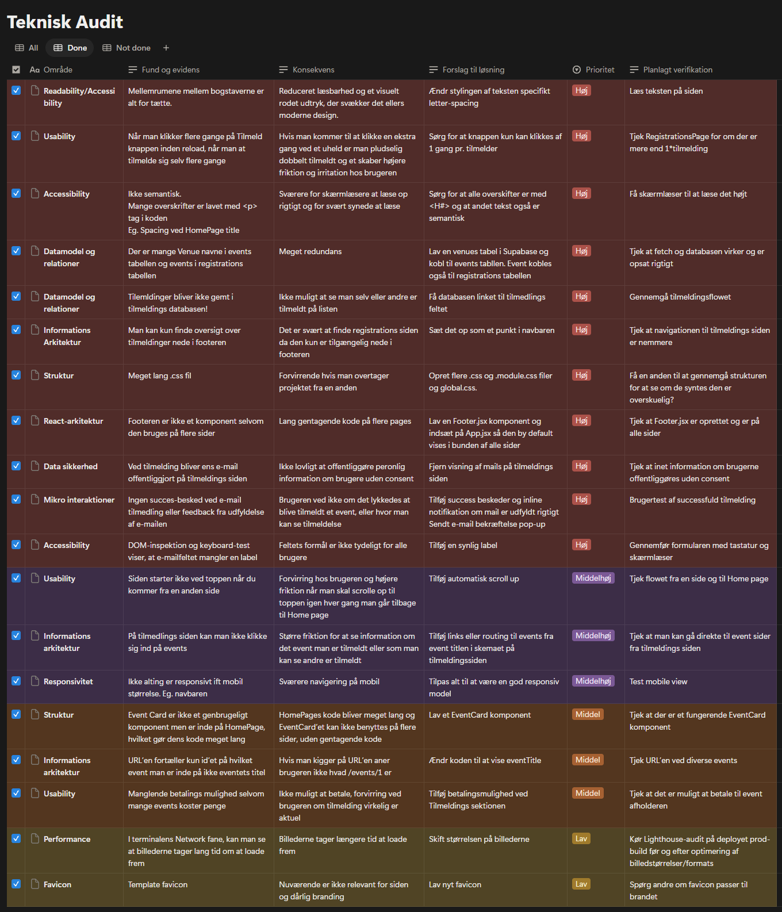

# Mellemrum

Mellemrum er en React-prototype for en lokal kultur- og eventplatform.

Den primære målgruppe er personer, der ønsker en enkel vej til at opdage og tilmelde sig lokale kulturoplevelser i Aarhus. Arrangører er en sekundær målgruppe, som bruger platformen til at dele events og få overblik over tilmeldinger.

---

## Links
* **Live demo:** [Se den deployede løsning på GitHub Pages her!](https://fkaysr.github.io/case1-optimization/)

---

## Teknisk audit & prioritering

*[Table made in Notion](https://private-apogee-a72.notion.site/3c85785bc37080c8aafac0a4bf963939?v=3cf5785bc370809bb791000cf28164ec&source=copy_link)*

---

## Datamodel & Supabase-struktur
Datamodellen er blevet omstruktureret fra 2 tabeller til 3 tabeller der nu snakker sammen. Det fjerner gentagne informationer og gør både koden og dataen meget nemmere at vedligeholde:
* **`events`** - Indeholder arrangementer og henviste data. Der er tilføjet en `mobilepayLink` kolonne, som muliggør dynamisk conditional rendering af betalingslinks på frontend (afprøvet med tre fiktive test-boxe). Billed-URL'er i tabellen er desuden ændret til mindre størrelser for at optimere indlæsningen baseret på analyser i DevTools Network-panelet.
* **`venues` (Ny tabel)** - Oprettet for at udskille lokationsdata (`venueName`, `venueLocation` osv.). Indholdet hentes nu dynamisk i `events`-tabellen via en `venue` fremmednøgle (Foreign Key). Gør at hvis f.eks. et spillested skifter navn eller adresse, skal det nu kun rettes ét sted i databasen.
* **`registrations`** - Refaktoreret ved at fjerne duplikerede felter som `eventName`. Tilmeldinger kobles nu direkte til det specifikke event via en `eventId` fremmednøgle.